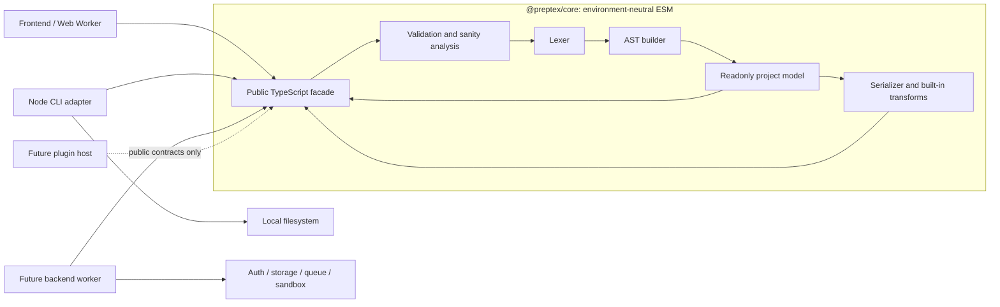

# PrepTeX Core architecture

## Purpose and scope

PrepTeX Core is a source-preserving structural parser and transformer for a
practical subset of LaTeX. It recognizes enough document structure to inspect a
project, resolve selected boolean conditions, remove comments, and preserve or
inline `\input` files. It is designed as a shared library for a frontend, CLI,
future backend services, and future plugin hosts.

PrepTeX does not expand macros, evaluate TeX, load packages, validate all LaTeX
semantics, format a document, compile a PDF, or sandbox untrusted TeX. Unknown or
disabled constructs are preserved as source text where possible.

## System context



Only `core/src/index.ts` defines the supported package surface. Downstream code
imports `@preptex/core`; lexer, parser, sanity-checker, call-stack, and renderer
modules are private even if their files are visible in the repository.

## Repository components

| Component                      | Responsibility                                                                   | May depend on                            |
| ------------------------------ | -------------------------------------------------------------------------------- | ---------------------------------------- |
| `core/src/api-types.ts`        | Public AST, project, diagnostic, and result data contracts                       | Environment-neutral TypeScript only      |
| `core/src/errors.ts`           | Typed expected failures and stable error codes                                   | Public diagnostic types                  |
| `core/src/lib/options.ts`      | Named parse, serialization, and input-handling options                           | Public domain types                      |
| `core/src/lib/lexer/`          | Convert source offsets into tokens for enabled structural categories             | Strings and parse options                |
| `core/src/lib/parse/`          | Detect problematic intersections and construct a source-preserving AST           | Lexer and internal mutable parse state   |
| `core/src/lib/transform/`      | Traverse readonly trees, filter conditions/comments, and render LaTeX            | Public AST shapes and virtual file roots |
| `core/src/lib/virtual-path.ts` | Normalize and resolve project-relative identifiers                               | Strings only; never the host filesystem  |
| `core/src/lib/core.ts`         | Runtime validation, freezing, diagnostics, and public orchestration              | All internal core layers                 |
| `cli/`                         | Discover `.tex` files, call the public API, report diagnostics, and write output | Node.js and `@preptex/core`              |
| `docs/api/`                    | Generated Markdown reference                                                     | TSDoc from the public entry point        |

The core deliberately contains no filesystem, process, DOM, storage, network, or
application-state dependency. Such dependencies belong to adapters.

## Public API

The generated `index.d.ts` and its TSDoc are authoritative. The main operations
are:

| Operation             | Input                                               | Output and role                                                                                   |
| --------------------- | --------------------------------------------------- | ------------------------------------------------------------------------------------------------- |
| `parseDocument`       | One source string plus `ParseOptions`               | An immutable `ParseResult` with an `AstRoot`, warnings, declared conditions, and referenced files |
| `parseProject`        | Versioned `SourceFile[]` plus uniform parse options | An immutable `ParsedProject`; every supplied file is parsed and files are path-sorted             |
| `mergeProjects`       | A base and update project snapshot                  | A new snapshot; equal or newer file versions replace matching paths                               |
| `serializeDocument`   | One parsed root plus serialization options          | One LaTeX string; `\input` remains literal because no project is available                        |
| `transformProject`    | Entry path, parsed project, and transform options   | One or more `TransformedFile` values                                                              |
| `isContainerNode`     | Any public AST node                                 | A type guard for nodes with children                                                              |
| `isInputHandlingMode` | An unknown runtime value                            | A type guard for configuration and CLI boundaries                                                 |

`PrepTexError` and `PrepTexSyntaxError` represent expected failures. Stable enum
codes are for control flow; human-readable messages are not a protocol.

### AST model

`AstNode` is an exhaustive discriminated union keyed by `NodeType`. It includes a
synthetic root plus text, newline, comment, command, condition declaration,
environment, condition, branch, math, group, section, and input nodes. Container
nodes store children in source order and retain their original prefix and suffix;
leaf nodes retain their exact source spelling. This representation enables a
default parse/serialize round trip without regenerating LaTeX syntax.

The structural grammar currently recognizes:

- general control sequences and starred command spelling;
- brace groups;
- named `\begin`/`\end` environments, with `document` represented as a level-zero
  section wrapper;
- `\section` through `\subparagraph` (configurable maximum level);
- dollar and `\(`/`\[` math delimiters;
- percent comments and the `comment` environment;
- `\newif`, `\if...`, `\else`, and `\fi` condition structures;
- braced `\input{...}` references;
- LF, CR, and CRLF line endings.

Callers can restrict token categories through `TokenType`. Disabled or
reclassified syntax is retained as ordinary source where feasible.

### Identity, mutability, and transport

Public result graphs are deeply readonly in TypeScript and frozen by the public
facade at runtime. They contain plain, acyclic data suitable for structured
cloning or JSON-shaped serialization. Errors should be converted to an explicit
DTO before crossing a worker or network boundary.

A node ID is unique only within its parsed file. The usable address is therefore
`(file.path, node.id)`. IDs and object identities do not survive reparsing.
Serialization and transformation do not mutate a tree, so nodes keep their
identity during those operations. `mergeProjects` retains object identity for
canonical deeply frozen files not replaced by the update snapshot; mutable
transported files are validated, copied, and frozen first.

Structured cloning creates new objects and does not preserve `Object.freeze`.
The receiving side must honor the readonly contract (and may freeze its local
copy if runtime enforcement is required).

### Locations and diagnostics

Each node and diagnostic range refers to the original JavaScript source string:

- `start` and `end` are zero-based, inclusive UTF-16 code-unit offsets;
- `line` is one-based and identifies the line containing `start`;
- the empty root uses `start = 0`, `end = -1`, and `line = 1`.

Successful results can carry warning diagnostics for a parser fallback,
reclassification, unmatched closing construct, or structural intersection.
Malformed or unbalanced supported syntax throws `PrepTexSyntaxError` with an
error diagnostic. Project parsing is atomic from the caller's perspective: it
throws when a file fails and does not return a partial `ParsedProject`.

Transformed output currently has no source map. Once comments, branches, or
inputs are removed or inlined, original offsets must not be applied to output
text.

## Normal data flow

1. An adapter loads authorized source into `{ path, source, version }` records.
2. `parseProject` validates and normalizes virtual paths, runs sanity analysis,
   tokenizes each source, builds each tree, freezes the result, and aggregates
   conditions and diagnostics.
3. A frontend or backend reads diagnostics and traverses `AstNode` using
   `NodeType` and `isContainerNode`.
4. Optional changed files are parsed separately and combined with
   `mergeProjects`. The caller keeps parse options consistent across snapshots.
5. `transformProject` resolves the entry and applies condition/comment options.
6. The adapter consumes virtual output files and performs any real I/O after its
   own authorization and containment checks.

```text
SourceFile[]
    -> parseProject(...)
    -> ParsedProject { files, declaredConditions, diagnostics }
    -> inspect / mergeProjects(...)
    -> transformProject(entryPath, ...)
    -> TransformedFile[]
    -> adapter-controlled storage, download, or compilation sandbox
```

All core arrows are synchronous, deterministic, and free of external effects.

## Transformation semantics

`SerializeOptions` provide two built-in transformations:

- `suppressComments` replaces recognized comments with safe spacing and avoids
  retaining lines made empty by suppression.
- When `enabledConditions` is omitted, condition syntax is preserved. When it is
  supplied, listed names keep their `if` branch and other recognized names keep
  their `else` branch; the recognized condition wrappers, declarations, and
  toggle commands are omitted from the rendered result.

`InputHandlingMode` determines the output topology:

| Mode                 | Output                                                                               |
| -------------------- | ------------------------------------------------------------------------------------ |
| `Preserve` (default) | Emit the entry file only and retain each `\input` command literally                  |
| `Flatten`            | Emit the entry file only, recursively replacing reachable inputs with their contents |
| `Separate`           | Emit every parsed project file separately without inlining inputs                    |

Flattening resolves relative references from the including virtual file. It
tries normalized paths with and without `.tex`, supports a unique
case-insensitive match, and finally a unique basename match. Missing, ambiguous,
and active circular references fail with typed errors. Repeated non-circular
inclusions are allowed and can enlarge output substantially.

## Adapter boundaries

### Frontend

A frontend installs a published, versioned `@preptex/core` dependency. Version
0.2.0 was published on 2026-09-03; this repository now prepares the compatible
0.2.1 corrections and bundled documentation.
Because the package is environment-neutral ESM, parsing can run in a browser or
Web Worker without Node polyfills. Large documents should be parsed off the UI
thread. Framework state should hold readonly project data or a derived view, not
mutate AST nodes. See `integration.md` for the consumer workflow.

### CLI

The CLI is a thin Node adapter. Its transform path recursively reads `.tex`
files, converts OS paths to forward-slash virtual paths, assigns source versions,
calls `parseProject` and `transformProject`, reports diagnostics to stderr, and
writes the returned virtual files. Its `ast` command is an inspection adapter
that prints the public parsed representation as JSON. Filesystem behavior and CLI
presentation are not part of the core API, and backend code should not reuse CLI
internals as a service layer.

### Backend

A future backend should keep request and persistence DTOs outside the core. It
authenticates a project, loads bounded source records, invokes the synchronous
core inside an appropriately bounded worker/job, serializes diagnostics and
typed errors, and validates virtual output paths before persistence. It also owns
cancellation, retries, idempotency, observability, caching, storage versions, and
any TeX compilation sandbox.

Core virtual-path validation is not filesystem security. A backend must reject
absolute paths and traversal again at its boundary, resolve against an
authorized canonical root, account for symlinks and platform case behavior, and
prove containment before every read or write. See
`integration.md` for detailed worker architecture, quotas, and security controls.

### Plugins

No custom transformer or plugin hook is currently public. A plugin can consume
the versioned public types, inspect readonly project data, and return a new
document-level artifact through a host-defined protocol. It must not import
`core/src/lib/transform`, mutate AST nodes, or rely on unexported fields.

A future plugin protocol should be versioned independently and include
capabilities, typed DTOs, namespaced diagnostics, cancellation, resource limits,
and isolation. Only a generally useful, environment-neutral primitive should be
promoted into `@preptex/core`, and doing so is a public API change.

## Performance and concurrency

Parsing and transformation are synchronous CPU work. Parsing performs more than
one linear source pass and `parseProject` parses all supplied files, including
unreachable ones. Tree traversal is iterative in the renderer, but generated
size depends on the input graph and repeated inclusions.

- Use a Web Worker for responsive browser applications.
- Use worker threads, processes, or queued jobs for large or untrusted backend
  requests.
- Limit source bytes, file count, nesting, wall time, and generated bytes outside
  the core.
- Independent calls do not share mutable project state and can run concurrently.
- Cache keys must include core version, virtual path, source content/version, and
  parse options.
- Incremental merging avoids replacing unchanged parsed files, but changed files
  still require parsing and deletions require constructing a new snapshot.

## Stability and release boundaries

The explicit exports from `core/src/index.ts` are the compatibility boundary.
Public functions, named types, enums, readonly fields, error codes, defaults,
range conventions, and documented identity behavior follow package SemVer.
Internal modules may change without notice and are not valid deep-import targets.

TypeDoc generates `docs/api/` from public TSDoc. Generated pages are a reference,
while the compact integration guide explains correct composition. A release must
build declarations, pass runtime and compile-time tests, regenerate documentation,
and verify the actual package tarball before a downstream application updates its
dependency.

## Known limitations

- The supported syntax is structural and intentionally incomplete; TeX macro
  expansion, catcodes, package semantics, and compilation are out of scope.
- Sanity analysis can reclassify intersecting math, condition, or section syntax
  as ordinary commands/text and reports that fallback as a diagnostic.
- Default condition recognition treats control-sequence names beginning with
  `\if` (except `\iff`) as structural openers. Command-style macros such as
  `\ifthenelse` require condition tokenization to be disabled if they should be
  preserved as ordinary commands; they then cannot be resolved by a transform.
- Only braced `\input` is a project edge; `\include`, dynamic filenames, and
  macro-generated paths are not resolved.
- The output has no source map or node-to-output position table.
- Parsing and transformation are not streaming or asynchronous.
- Node IDs are ephemeral, and project snapshots do not record their parse
  options.
- `mergeProjects` has version-based replacement but no deletion primitive or
  conflict history.
- There is no public mutation builder, visitor/rewriter, custom transformer hook,
  backend service, or plugin runtime yet.
